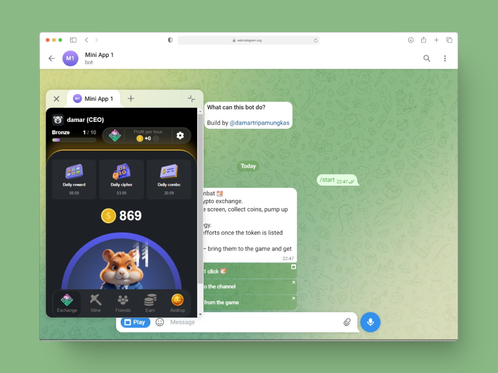

<h1 align="center">
    TG-MA-HAMSTER-KOMBAT
</h1>

  
  
  

 

 

### 💻 Demo

https://t.me/tg_ma_1_bot

### 📝 Information

This project features a Telegram mini app and bot that are seamlessly integrated, drawing design inspiration from Hamster Kombat. Key aspects of this project include:

- Interactive Gameplay: Users can engage in fun and interactive battles within the Telegram environment, enjoying a unique gaming experience directly in their chat.

- User-Friendly Design: The interface is designed to be intuitive and visually appealing, making it easy for users to navigate and enjoy the game.

- Customization Options: Players can choose from various characters and abilities, enhancing the gameplay experience and allowing for strategic battles.

If you're interested in developing a project like this or have any ideas you'd like to discuss.

### 🔨 Tech stack

- TypeScript
- Node.js
- React

### 💬 Contact

please feel free to reach out to me via Telegram: https://t.me/damartripamungkas. I'm here to help bring your vision to life!
